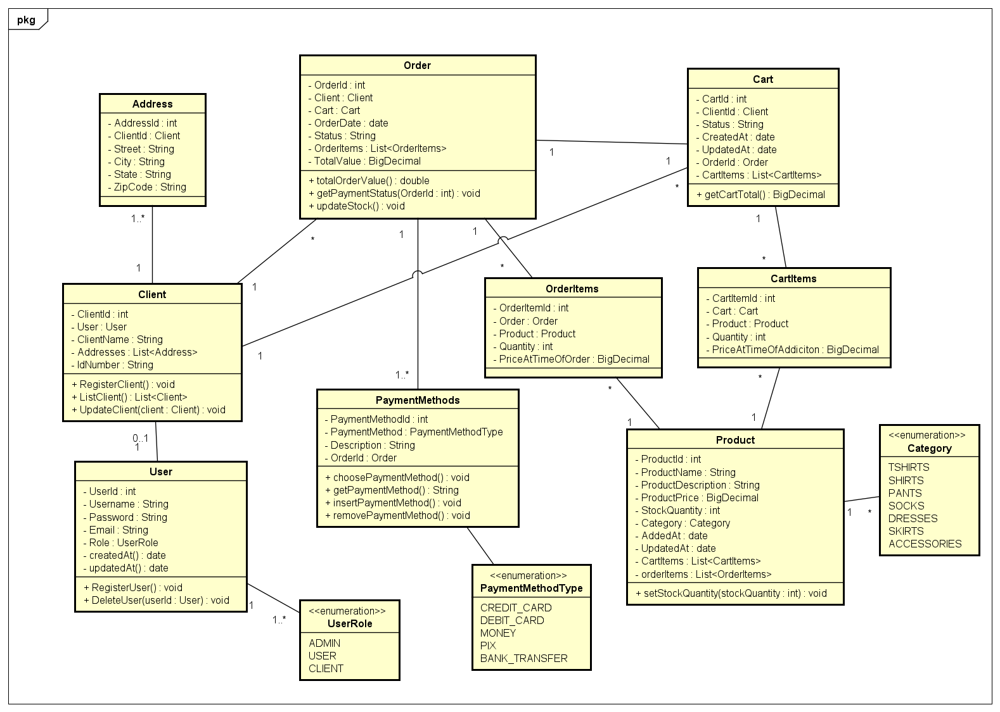

# Tarket Market

### Tarket is a webmarket project made by @TriniTxn



### Java version
```xml
<properties>
    <java.version>21</java.version>
</properties>
```

### application.properties

```
spring.profiles.active=test
spring.jpa.open-in-view=false

cors.origin=${CORS_ORIGINS:http://localhost:5173,http://localhost:3000}
```

### application-test.properties

```
# H2 Connection
spring.datasource.url=jdbc:h2:mem:banktest
spring.datasource.username=sa
spring.datasource.password=

# H2 Client
spring.h2.console.enabled=true
spring.h2.console.path=/h2

# Show SQL
spring.jpa.show-sql=true
spring.jpa.properties.hibernate.format_sql=true
```

### application-prod.properties
```
spring.datasource.url=${DB_URL}
spring.datasource.username=${DB_USERNAME}
spring.datasource.password=${DB_PASSWORD}

spring.jpa.hibernate.ddl-auto=update
```